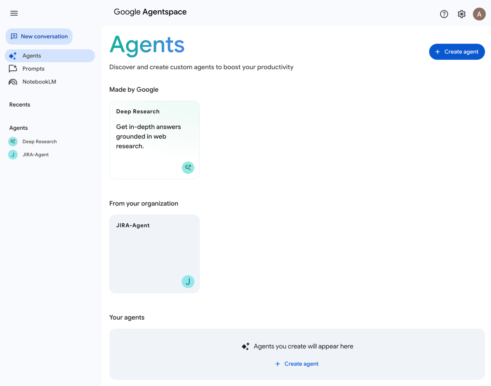
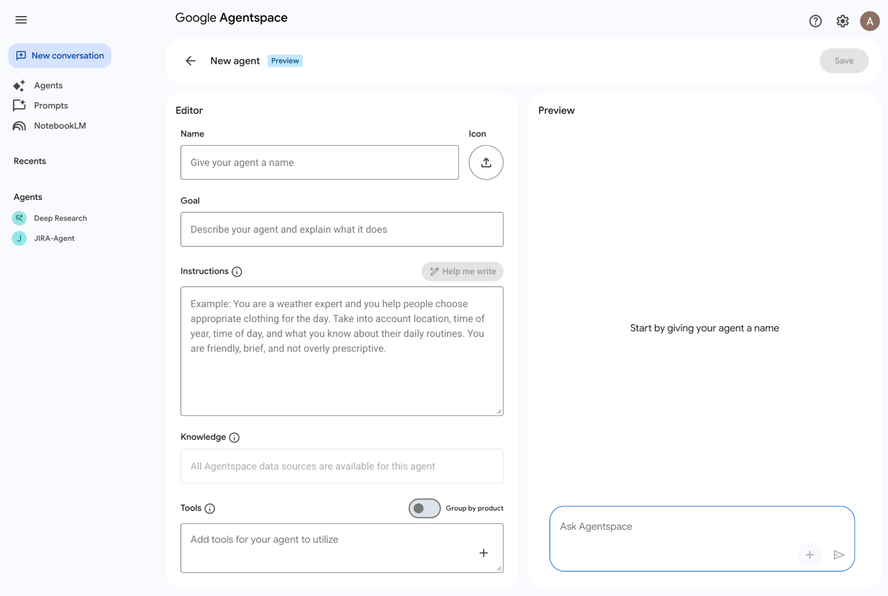
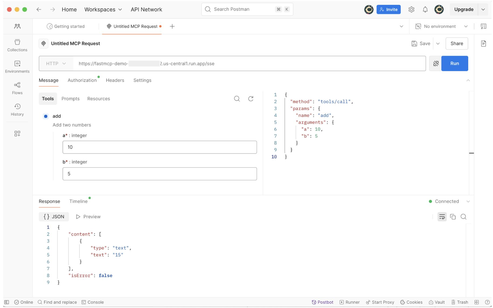

# So You want to build a GenAI Agent on Google Cloud?

---
**\* The opinions expressed in this article are solely those of the author([Andrey Shakirov](https://www.linkedin.com/in/andrey-shakirov-000b4a5/)) and do not reflect the views of their employer.**

---

This article will go over some of the options(there are a few, as you guessed already 🙂 ) you have to build a GenAI Agent on Google Cloud platform. It will discuss both low code, no-code options (Agentspace, Agent Build|AI Applications) as well as frameworks(Agent Development Kit, ADK) that developers can use to build and deploy multi-agent systems.

**TLDR:**

* [**Agentspace**](https://cloud.google.com/products/agentspace) \- Enterprise search over your enterprise data sources, Gemini for summarization and multi-modal content generation and GenAI agents for actions to help you work faster.  
* [**AI Applications | Agent Builder**](https://cloud.google.com/products/agent-builder) \- no-code, low-code option to build, deploy and integrate agents into the interfaces that your users use already(Existing web applications, Slack, Google Chat, MS Team, Agentspace, etc)  
* [**Agent Development Kit**](https://google.github.io/adk-docs/)**(ADK)** developer focused option. An open-source, code-first Python toolkit for building, evaluating, and deploying sophisticated multi-agents systems with flexibility and control.

This article outlines the key topics for building GenAI Agents on Google Cloud.

[Agentspace](#agentspace)

* [Overview](#overview)

* [Agent gallery](#agent-gallery)

* [Build new agent flow](#build-new-agent-flow)

[Agent Builder | AI applications \- low code, no code option](#agent-builder-|-ai-applications---low-code,-no-code-option)

* [Overview](#overview-1)

* [Tools](#tools)

* [Data store tools](#data-store-tools)

* [Connectors](#connectors)

* [Function tools](#function-tools)

* [Out of the box Integrations](#out-of-the-box-integrations)

* [Prebuilt Generative Agents](#prebuilt-generative-agents)

* [Integration into Agentspace](#integration-into-agentspace)

* [Agent Builder Codelab](#agent-builder-codelab)

[Agent Development Kit \- developer focused option](#agent-development-kit---developer-focused-option)

* [Overview](#overview-2)

* [ADK Agents](#adk-agents)

* [Using different LLM models with ADK](#using-different-llm-models-with-adk)

* [ADK Tools](#adk-tools)

* [ADK MCP support](#adk-mcp-support)

* [Deployment](#deployment)

* [Agent Garden](#agent-garden)

* [Conceptual overview](#conceptual-overview)

* [Testing with postman](#testing-with-postman)

* [Real-world use cases](#real-world-use-cases)

[Conclusion](#conclusion)

# Agentspace 
{#agentspace}

## Overview 
{#overview}

[Agentspace](https://cloud.google.com/products/agentspace) \- unlocks enterprise expertise for employees with agents that bring together Gemini’s advanced reasoning, Google-quality enterprise search, and enterprise data.

Here are some of the capabilities of Agentspace:

**Search** \- Help your employees find what they need at the right time and answer questions.  
Sample use cases:

- Get personalized and grounded  generative answers with citations  from private and web sources.  
- Search for content across enterprise systems and the internet.

**Summarization** \- Condense and summarize your enterprise knowledge.  
Sample use cases:

- Quickly prepare for meetings by generating summaries across docs, emails and external sources to highlight takeaways, action items, and insights.  
- Securely upload documents and videos to summarize and ask questions.

**Generation** \- Create new content based on existing enterprise knowledge and internet data.  
Sample use cases:

- Generate product descriptions.  
- Generate release notes from content.

**Actions** \- Interact with pre-configured or custom agents that take actions and streamline workflows.  
Sample use cases:

- Send emails.  
- Schedule meetings.  
- Update data in third party systems(eg. JIRA).

**App**: An Agentspace Enterprise app is an entity that delivers search results to your end users and if Agentspace Enterprise Plus is enabled, an app also offers **assistant and agent** capabilities. The term *app* can be used interchangeably with the term *engine* in the context of APIs.

**Data store**: A data store is an entity that contains the data ingested from a first-party data source such as Cloud Storage or third-party applications such as Jira or Salesforce. Data stores that contain data from third-party applications are also called *data connectors*.

Agentspace web application:

## Agent gallery 
{#agent-gallery}

The [Agents gallery](https://cloud.google.com/agentspace/agentspace-enterprise/docs/agents-gallery) is a portal in Google **Agentspace Enterprise** that lets you access, create, and manage your agents. It showcases the following categories of agents:

* **Premade by Google**: Includes the agents that are available for you out-of-the-box and serve a specific function, such as [Deep Research](https://cloud.google.com/agentspace/agentspace-enterprise/docs/research-assistant).  
  * **Deep Research** is a Premade by Google agent for users who need to gather, analyze, and understand internal and external information.  
  * **Idea Generation** is an [agent](https://cloud.google.com/agentspace/agentspace-enterprise/docs/idea-generation) that's premade by Google. Its goal is to help with innovation and problem-solving for enterprise users by combining advanced AI with a unique tournament-style competition framework to generate and rank ideas.  
* **From your company**: Includes the agents that your organization has created or has added.  
* **Your agents**: Includes the no-code agents that you can create using Agent Designer.

## Build new agent flow 
{#build-new-agent-flow}

The Agent Designer in Agentspace lets you create your own agents, customized to your workflow and connected to your data—with no technical expertise required.

Once you click “Save” the new agent is deployed and production ready(all managed by Google Cloud) and ready to engage with your team in the Agentspace chat.

# Agent Builder | AI applications \- low code, no code option 
{#agent-builder-|-ai-applications---low-code,-no-code-option}

## Overview 
{#overview-1}

Vertex AI [Agent Builder](https://cloud.google.com/products/agent-builder) (AI Applications in the Google Cloud Console) helps you turn your processes into multi-agent experiences by building on them, and not disrupting them–regardless of where you stand in your AI journey or which technology stack you've chosen.

Options to create a new Agent:

<table>
  <tr>
    <td style="vertical-align: top;">
      Left side menu with the options:
       
      
    </td>
    <td style="vertical-align: top;">
      New Agent screen:
       
      
    </td>
  </tr>
</table>

## Tools 
{#tools}

Using [tools](https://cloud.google.com/dialogflow/cx/docs/concept/playbook/tool), you can connect playbooks to external systems. These systems can augment the knowledge of playbooks and empower them to execute complex tasks efficiently.

If you API requires authentication, you have following options to securely connect to it.

## Data store tools 
{#data-store-tools}

Generative agents can leverage [data store tools](https://cloud.google.com/dialogflow/cx/docs/concept/data-store/handler) to answer end-user questions using information from your data stores. Your list might have more options than what is displayed below.

## Connectors 
{#connectors}

[Connector tools](https://cloud.google.com/dialogflow/cx/docs/concept/playbook/tool#connector) can be used by an agent to perform actions using your Connections configured in Integration Connectors. Each connector tool is configured with a single Connection and one or more actions. If needed, multiple tools can be created for a single Connection to group different actions together for your agent to use.

## Function tools 
{#function-tools}

Utilize [function tools](https://cloud.google.com/dialogflow/cx/docs/concept/playbook/tool#function) when client-side code offers functionality not supported by OpenAPI tools. These tools execute on the client side, not within the agent itself.

## Out of the box Integrations 
{#out-of-the-box-integrations}

This platform offers comprehensive integration capabilities, empowering agents for diverse customer interactions. "One-click Telephony" integrations like Avaya and Twilio streamline voice communication, enabling direct calling, routing, recording, and integrated call logs for efficient phone support. 

For text-based interactions, the platform supports popular messaging channels such as Conversational Messenger, Facebook Messenger, LINE, Google Chat, Slack, Discord, Telegram, Viber, and even enterprise solutions like Facebook Workplace and Cisco Webex (formerly Spark). 

Additionally, integrations with specialized messaging platforms like MMD Smart and services like Twilio (for general text messaging) and Azure Bot Service/Skype allow agents to engage with customers on their preferred channels, providing a seamless and centralized experience for handling inquiries across various digital communication touchpoints.

## Prebuilt Generative Agents 
{#prebuilt-generative-agents}

Prebuilt Generative Agents offer a way to speed up the creation of new agents. They provide examples of solutions for typical tasks and situations, and can demonstrate recommended approaches.

## Integration into Agentspace 
{#integration-into-agentspace}

After creating your agent in AI Applications (Agent Builder), integrate it within the Agentspace application by navigating to Configurations / Assistant.

## Agent Builder Codelab 
{#agent-builder-codelab}

Checkout this codelab that shows how to build **GenAI Agent in Slack for Q\&A over docs and actions with API calls:** [https://codelabs.developers.google.com/genai-for-dev-slack-agent](https://codelabs.developers.google.com/genai-for-dev-slack-agent) 

This codelab is based on the open source repository:  
[https://github.com/GoogleCloudPlatform/genai-for-developers](https://github.com/GoogleCloudPlatform/genai-for-developers) 

The repository contains reference implementations for different use cases like code reviews and dev tasks automation, etc.

# Agent Development Kit \- developer focused option 
{#agent-development-kit---developer-focused-option}

## Overview 
{#overview-2}

The Agent Development Kit ([ADK](https://google.github.io/adk-docs/)) is a flexible and modular framework designed for the development and deployment of AI agents. It aims to bring software development best practices to the creation of agentic architectures, facilitating the building, deploying, and orchestrating of simple to complex workflows. Although optimized for Gemini and the Google ecosystem, the ADK is model-agnostic, deployment-agnostic, and compatible with other frameworks.

## ADK Agents 
{#adk-agents}

ADK offers various agent types designed to facilitate the creation of advanced applications. These categories provide a structured approach to development, enabling builders to leverage specific functionalities tailored to different GenAI use cases. Understanding these distinct categories is crucial for effectively utilizing the ADK to construct sophisticated and targeted solutions.  

## Using different LLM models with ADK 
{#using-different-llm-models-with-adk}

The Agent Development Kit (ADK) is designed for flexibility, allowing you to integrate various Large Language Models (LLMs) into your agents. 

Here are some of the options for LLM models that ADK can use:

* Using Google Gemini Models  
* Using Anthropic models  
* Using Cloud & Proprietary Models via LiteLLM  
* Using Open & Local Models via LiteLLM  
* Self-Hosted Endpoint (e.g., vLLM)  
* Using Hosted & Tuned Models on Vertex AI  
* Third-Party Models on Vertex AI (e.g., Anthropic Claude)  
* etc

## ADK Tools 
{#adk-tools}

Within the Agent Development Kit (ADK), a Tool equips AI agents with specific functionalities, allowing them to act and engage with the external world, going beyond standard text generation and logical reasoning. The effective utilization of tools is a key differentiator between advanced agents and fundamental language models.

From a technical perspective, a tool is usually a self-contained piece of code, such as a Python or Java function, a class method, or even another specialized agent. These tools are built to perform specific, predetermined tasks, frequently involving interactions with external systems or data sources.

Tools perform specific actions, such as:

* Querying databases  
* Making API requests (e.g., fetching weather data, booking systems)  
* Searching the web  
* Executing code snippets  
* Retrieving information from documents (RAG)  
* Interacting with other software or services

## ADK MCP support 
{#adk-mcp-support}

ADK helps you both use and consume MCP tools in your agents, whether you're trying to build a tool to call an MCP service, or exposing an MCP server for other developers or agents to interact with your tools.

Here are couple of examples:

**ADK Agent and FastMCP** server deployed on Cloud Run with authentication enabled integration: [https://github.com/gitrey/adk-fastmcp](https://github.com/gitrey/adk-fastmcp) 

**MCP Toolbox for Databases** is an [open source](https://github.com/googleapis/genai-toolbox) MCP server that helps you build Gen AI tools so that your agents can access data in your database. Google’s Agent Development Kit (ADK) has built in support for The MCP Toolbox for Databases.

### Pre-built tools allow you to connect to various databases from your IDE:

### Sample config for VSCode to connect to local PostgreSQL database:

## Deployment 
{#deployment}

Depending on your requirements for production readiness and the need for custom flexibility, your ADK agent offers deployment options across various environments.  

## Agent Garden 
{#agent-garden}

[Agent Garden](https://console.cloud.google.com/vertex-ai/agents/agent-garden) is a collection of ready-to-use samples and tools directly accessible within ADK. Leverage pre-built agent patterns and components to accelerate your development process and learn from working examples. GitHub repo: [https://github.com/google/adk-samples](https://github.com/google/adk-samples) 

Leverage your team's existing expertise by building agents with popular open source frameworks like Agent Development Kit, LangGraph, or many more and then seamlessly deploying them on Vertex AI. 

Connect custom agents to Google's enterprise-grade infrastructure without rewriting your code or changing your development workflow. Take advantage of Vertex AI's scaling, monitoring, and security capabilities while maintaining the flexibility of your chosen framework. Start with our step-by-step tutorials that guide you through the complete process from local development to production deployment.

## 

## Conceptual overview 
{#conceptual-overview}

This 25-minute video provides a comprehensive overview of the ADK.

 [Agent Development Kit (ADK) - Conceptual Overview](https://www.youtube.com/watch?v=CFOBf3vMF_8)

## Testing with postman 
{#testing-with-postman}

You can use your favorite tool postman to test your MCP server tools/endpoints:

## How it all fits together:

# Real-world use cases 
{#real-world-use-cases}

Explore 601 real-world use cases from leading organizations leveraging AI Agents to improve their operations. 

[https://cloud.google.com/transform/101-real-world-generative-ai-use-cases-from-industry-leaders](https://cloud.google.com/transform/101-real-world-generative-ai-use-cases-from-industry-leaders) 

**Customer Agents:** Focusing on customer interaction and service (e.g., United Wholesale Mortgage, Motorola, Personal AI).

**Employee Agents**: Assisting with internal processes and employee productivity (e.g., Toyota, Uber, Flashpoint).

**Code Agents**: Utilizing AI for software development and related tasks (e.g., Capgemini, CME Group, ROSHN Group).

**Data Agents**: Managing and interpreting data (e.g., Colombia's Ministry of Information and Communications Technologies, BT Group).

**Creative Agents**: Supporting creative endeavors (e.g., The Estee Lauder Companies).

**Security Agents**: Detecting fraud and combat money laundering(e.g., Airwallex, Bradesco)

# Conclusion 
{#conclusion}

Building GenAI Agents on Google Cloud offers multiple pathways tailored to different needs and skill levels. 

For quick deployment and ease of use, **Agentspace** provides pre-built agents and a no-code agent designer. 

**Agent Builder (AI Applications)** serves as a low-code/no-code option for integrating agents into existing systems and workflows. 

Developers seeking maximum flexibility and control can utilize the **Agent Development Kit (ADK)**, an open-source toolkit for building sophisticated multi-agent systems with various LLM integrations.

---

### This is series of articles on building and deploying applications on Google Cloud that unpack discussed options in more details.

1.  [Design, Prototype, Build, and Deploy on Google Cloud: A Comprehensive Guide](https://github.com/gitrey/design-prototype-build-deploy-on-gcp)

2.  [So You've Built Your Idea and Want to Share It with the World?](https://github.com/gitrey/deployment-options-on-gcp)

---

**\* The opinions expressed in this article are solely those of the author([Andrey Shakirov](https://www.linkedin.com/in/andrey-shakirov-000b4a5/)) and do not reflect the views of their employer.**

---
